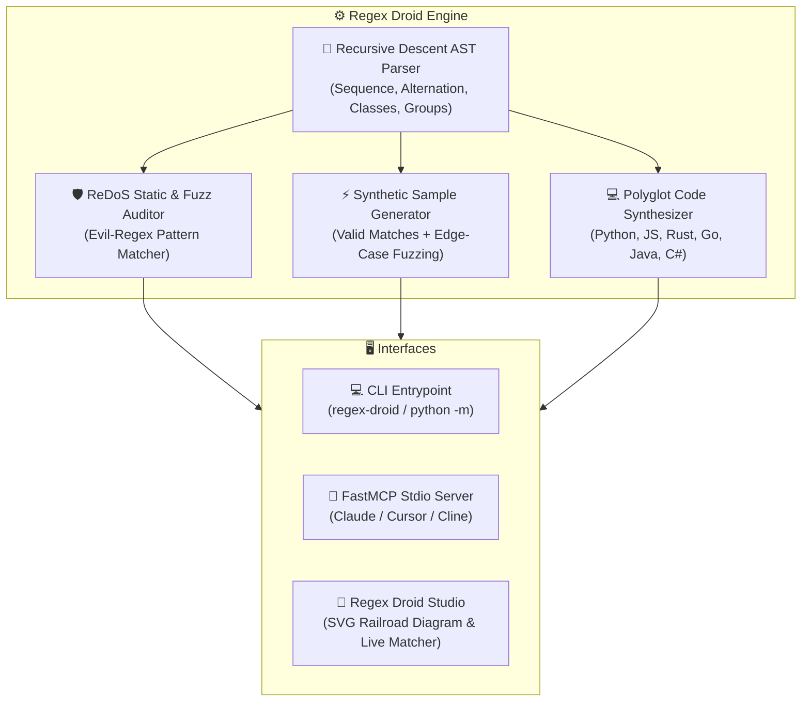

# 🤖 Regex Droid Builder

[](https://github.com/1nc0gn30/regex-droid-builder/actions)
[](https://www.python.org/downloads/)
[](https://github.com/1nc0gn30/regex-droid-builder)
[](https://modelcontextprotocol.io/)
[](https://opensource.org/licenses/MIT)

> **Visual Regular Expression AST Builder, Static ReDoS Catastrophic Backtracking Vulnerability Detector & Multi-Language Code Generator with Material 3 Web UI, Multi-OS CLI, FastMCP stdio server, and zero external runtime dependencies.**

---

## ✨ Features

- 🌳 **Regex AST & Natural Language Explainer**: Parses regular expressions into structured AST trees and generates step-by-step, plain-English explanations of literals, character classes, anchors, and quantifiers.
- ⚖️ **Formal Equivalence & Subset Verifier**: Uses product automaton BFS to formally verify language equivalence ($L(A) == L(B)$) or subset containment ($L(A) \subseteq L(B)$) between two regexes, automatically synthesizing shortest counterexample strings when patterns diverge.
- 📐 **Canonical DFA State Minimization**: Implements Hopcroft / Moore equivalence partitioning to eliminate redundant states and unreachable cycles, producing mathematically optimal canonical DFAs.
- 🔄 **Cross-Flavor Dialect Transpiler**: Transpiles regex patterns across **Python (`re`)**, **PCRE2**, **JavaScript (ECMAScript 2024)**, **Go (`regexp` / RE2)**, **Rust (`regex`)**, and **POSIX ERE**, auditing for engine incompatibilities (lookarounds, backreferences, possessive quantifiers).
- 🛡️ **Static & Empirical ReDoS Defense**: Audits patterns for catastrophic exponential/polynomial backtracking risks (nested quantifiers like `(a+)+`, overlapping alternations inside loops, unanchored greedy wildcards) with complexity estimation (`O(N)`, `O(2^N)`) and remediation fixes.
- ⚡ **Multi-Language Code Generator**: Generates production-ready, type-safe snippet implementations in **Python (`re`)**, **JavaScript / TypeScript (`RegExp`)**, **Rust (`regex`)**, **Go (`regexp`)**, **Java**, and **C#**.
- 🎨 **Regex Droid Studio Web UI**: Real-time regex analyzer, interactive multi-line test matrix runner, flag toggles, curated presets catalog, and 1-click code copy (design influenced by Material 3 tokens).
- 🚀 **Zero Third-Party Runtime Dependencies**: 100% Python Standard Library runtime (`re`, `http.server`, `urllib`, `time`, `json`, `dataclasses`, `argparse`).
- 🤖 **FastMCP Server Protocol**: Full Model Context Protocol (MCP) JSON-RPC 2.0 stdio server for Claude Desktop, Cursor, Cline, and autonomous AI coding agents.

---

## 🚀 Quick Start

### Installation
```bash
# Clone the repository
git clone https://github.com/1nc0gn30/regex-droid-builder.git
cd regex-droid-builder

# Install in editable mode
pip install -e .
```

---

## 💻 CLI Usage

```bash
# Explain regex pattern in plain English
regex-droid explain '^[\w.+-]+@[\w-]+\.[a-zA-Z]{2,}$'

# Audit pattern for ReDoS vulnerabilities and catastrophic backtracking
regex-droid audit '(a+)+$'

# Test strings against a regular expression
regex-droid test '^https?:\/\/' 'https://google.com' 'ftp://server.org' 'http://localhost'

# Generate code in Python, JavaScript, Rust, Go, Java, and C#
regex-droid codegen '^#([0-9a-fA-F]{3}|[0-9a-fA-F]{6})$' --lang python

# List curated regex presets
regex-droid presets

# Formally verify regex equivalence or find shortest counterexamples
regex-droid compare 'a(b|c)' 'ab|ac'

# Transpile regex across dialects (Python -> JavaScript)
regex-droid transpile '(?P<name>\w+)' --from python --to javascript

# Minimize regex DFA via Hopcroft/Moore state partitioning
regex-droid minimize 'a(b|c)'

# Launch Regex Droid Studio Web UI (Material 3 influenced)
regex-droid serve --port 8097

# Start FastMCP stdio server for LLM agents
regex-droid mcp

# Run system diagnostics
regex-droid doctor
```

---

## 🤖 Model Context Protocol (MCP) Setup

Add `regex-droid-builder` to your Claude Desktop or Cursor configuration:

```json
{
  "mcpServers": {
    "regex-droid": {
      "command": "python3",
      "args": ["-m", "regex_droid_builder", "mcp"]
    }
  }
}
```

### Registered MCP Tools:
- `regex_explain`: Parse pattern and flags into plain English step-by-step AST explanation.
- `regex_analyze_redos`: Static & empirical ReDoS vulnerability audit with complexity estimation and remediation tips.
- `regex_compare_equivalence`: Formally compare two regular expressions for exact language equivalence $L(A) == L(B)$, subset containment, or disjointness, providing shortest counterexample strings if different.
- `regex_transpile_dialect`: Transpile regular expressions across dialects (Python, PCRE2, JavaScript, Go/RE2, Rust, POSIX ERE) with engine incompatibility warnings.
- `regex_minimize_dfa`: Compile a regex into a canonical minimal-state DFA using Hopcroft/Moore equivalence partitioning.
- `regex_test`: Execute multi-input test matrix against pattern with capture group extraction.
- `regex_generate_code`: Generate multi-language code snippets (Python, JS, Rust, Go, Java, C#).
- `regex_presets`: Query curated presets and test cases.
- `regex_automaton_analysis`: Compile regex into Thompson NFA and Subset-Construction DFA with state explosion checks.
- `regex_gas_meter`: Trace execution gas consumption step-by-step to prevent computational runaway.
- `regex_diagnostics`: Platform and toolchain health check.

---

## 📐 Mathematical Foundations & ReDoS Complexity

### 1. Backtracking Complexity Classification

| Complexity Class | Growth Rate | Vulnerability Rating | Canonical Danger Pattern | Attack Vector Example |
| :--- | :--- | :--- | :--- | :--- |
| **Linear** | $\mathcal{O}(N)$ | **SAFE** | `^[a-zA-Z0-9]+$` | Standard token validation |
| **Polynomial** | $\mathcal{O}(N^2) \dots \mathcal{O}(N^k)$ | **MEDIUM / HIGH** | `.*=.*&` | Query parameter parser |
| **Exponential** | $\mathcal{O}(2^N)$ | **CRITICAL** | `(a+)+$`, `(a\|aa)+$` | Nested star/plus quantifiers |

### 2. Catastrophic Backtracking Mechanics
When an NFA engine attempts to match an input of length $N$ against nested quantifiers $E = (R_1^+)^+$, the number of possible parsing paths grows combinatorially according to the partition integer function $P(N) \sim 2^{N-1}$:

$$\text{Steps}(N) \ge 2^N$$

A single non-matching character at the end of a 30-byte string (e.g. `aaaaaaaaaaaaaaaaaaaaaaaaaaaaaa!`) can trigger over $1{,}073{,}741{,}824$ recursive state transitions, causing complete thread freeze / CPU exhaustion.

---

## 🏛️ Architecture



---

## 🐍 Python SDK API Reference

```python
from regex_droid_builder.ast_engine import RegexASTParser, explain_regex, generate_test_samples
from regex_droid_builder.redos_detector import ReDoSAnalyzer
from regex_droid_builder.codegen import generate_code_snippets

# 1. Parse into AST & explain in natural language
pattern = r"^[\w.+-]+@[\w-]+\.[a-zA-Z]{2,}$"
parser = RegexASTParser(pattern)
ast = parser.parse()
breakdown = explain_regex(pattern)
for step in breakdown[:3]:
    print(f"{step['type']}: {step['explanation']}")

# 2. Audit ReDoS vulnerability
analyzer = ReDoSAnalyzer()
report = analyzer.analyze("(a+)+$")
print(f"Vulnerable: {report.is_vulnerable} (Severity: {report.severity.value})")
print(f"Complexity: {report.complexity_order}")

# 3. Generate synthetic matching & non-matching test strings
samples = generate_test_samples(pattern, count=3)
print(f"Valid matches: {samples['matching']}")
print(f"Invalid non-matches: {samples['non_matching']}")

# 4. Generate multi-language code snippets
snippets = generate_code_snippets(pattern)
print(snippets["python"])
```

---

## 🧪 Running Tests

```bash
pytest -v
```

---

## 📜 License

MIT License © 2026 1nc0gn30

